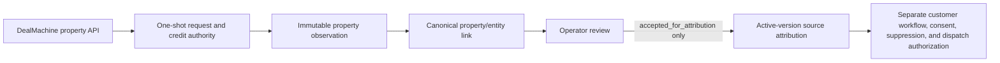

# DealMachine v2 property-discovery readiness

- Date: 2026-08-15
- Release base: `846cffc0085a3159d2e47c8fccd364fb1f209de0`
- Status: implemented and tested locally; database/app deployment and provider activation not performed
- Supersedes the runtime guidance in `GATE_1_DEALMACHINE_NATIVE_API_MIGRATION_2026-08-14.md`. That file remains historical export-retirement evidence.

## Outcome

VestBlock's DealMachine integration is now a property-observation source, not a lead, contact, list, mail, or outreach system. Sixteen approved property plans can count matching properties and, after a separate paid-search release, collect small property-only samples for operator review. Ten plans belong to `property_opportunity_discovery`; six belong to `seller_options_intake`. The disabled `active-stale-lowball` plan cannot be restored through runtime options.

No DealMachine observation can create a lead, authorize outreach, send email/direct mail, call n8n, activate a strategy, or count as a conversion.

## Current production posture

The Vercel project is linked and reachable from the Mac Air. A server-only `DEALMACHINE_API_KEY` variable exists, but the stored value does not match the current documented `dm_sk_live_*` or `dm_at_live_*` format. The following controls are false or absent:

- `DEALMACHINE_SOURCE_ENABLED`
- `DEALMACHINE_DISCOVERY_ENABLED`
- `DEALMACHINE_PAID_SEARCH_ENABLED`
- `OUTREACH_LIVE_SEND_ENABLED`

The database migration defaults `integration_enabled=false`, `maximum_operation=count_only`, and all paid-credit budgets to zero. Deployment alone therefore cannot call DealMachine.

The key pasted into a chat is not a safe activation credential. Rotate it in DealMachine, store the replacement only as `DEALMACHINE_API_KEY`, and verify account/plan/usage with the smallest read-only call before enabling discovery.

## Capability decisions

| DealMachine capability | VestBlock use | Initial state | Cost/risk boundary | Permitted downstream action |
| --- | --- | --- | --- | --- |
| Account, subscription, usage | Confirm organization, plan, and real monthly entitlement | Code-ready, disabled | Free/read-only; rotated key required | Readiness evidence only |
| Property filters and fields | Detect schema drift before a search | Code-ready, disabled | Free/read-only; property schema only | Compile approved filters |
| Locations | Resolve approved city/state markets | Code-ready, disabled | Free/read-only | Build property count request |
| Property count | Compare opportunity volume across 16 approved plans | Code-ready, disabled | Free; immutable request/evidence | Aggregate operator dashboard |
| Cost estimate | Reserve the correct upper bound | Code-ready, disabled | Free; never treated as approval | Credit-reservation input only |
| Property search | Sample at most 10 properties per strategy/run | Code-ready, separately disabled | Billable; DB run/day/month reservation; one provider call; no automatic retry | Immutable observation only |
| People/contact search | None | Prohibited | PII, consent, vendor-license, and cost risk | None |
| Enrichment/skip trace | Possible later legal/compliance phase | Not implemented | Paid/contact/privacy risk | None |
| Lists/leads/status mutation | Possible later reconciliation phase | Not implemented | Could overwrite canonical lifecycle | None |
| Export | None | Prohibited | Bulk data/cost/retention risk | None |
| Tasks/Driving | Future operator workflow research | Not implemented | Provider-side mutation | None |
| Mail/direct mail | None | Prohibited | Real-world send and wallet charge | None |

## Safety contract

- Only `DEALMACHINE_API_KEY` is read, and only on the server.
- Discovery and paid search are independent from the retired legacy source flag.
- Request bodies require `anchor=properties`, `contact_audience=none`, and approved property-only fields/filters.
- Responses containing people, contacts, names, phones, email, demographics, protected-class proxies, consumer-credit, political, health, income, or wealth fields are rejected before persistence.
- Paid property search never retries automatically.
- The database creates one immutable provider-call claim. An exact replay returns `should_execute=false` and cannot call DealMachine again.
- A claimed paid reservation counts at the full reserved amount until append-only settlement, including ambiguous outcomes.
- Raw payloads have field-specific freshness, confidence, provenance, and a bounded retention period with an evidenced one-way purge path.
- Multiple strategy/version attributions may reference the same property observation without overwriting each other.
- Source attribution requires an active canonical version and the latest prior operator review decision `accepted_for_attribution`.
- Operator review hard-codes `outreach_authorized=false`, `customer_workflow_authorized=false`, and `dispatch_authority=none`.
- All DealMachine-sourced legacy/current leads are independently blocked by outbound eligibility.

## Strategy ownership

`property_opportunity_discovery` owns:

- preforeclosure-equity
- tax-code-stack (tax evidence only; county code evidence remains missing)
- tax-remote-equity-rotation
- lien-equity
- probate-vacant-equity
- portfolio-landlord
- small-multifamily-portfolio
- builder-infill-teardown
- land-wholesale
- vacant-equity

`seller_options_intake` owns:

- seller-finance-free-clear
- subject-to-low-equity
- hybrid-equity-bridge
- novation-retail-equity
- absentee-equity-creative
- active-stale-creative

These mappings identify the future canonical source owner. They do not activate a strategy or authorize outreach.

## Activation sequence

Stop at the first failure.

1. Rotate the chat-exposed key in DealMachine. Do not paste the replacement into chat, source, logs, or a browser-visible variable.
2. Replace the Vercel Production `DEALMACHINE_API_KEY` as a sensitive server-only value. Keep all three DealMachine flags false/absent.
3. Deploy the reviewed code and migration. Confirm the database control is disabled and paid budgets are zero.
4. With explicit approval, perform one account/subscription/usage verification. Record only request ID, status, entitlement totals, and rate-limit metadata.
5. Enable `DEALMACHINE_DISCOVERY_ENABLED=true` and release database `count_only` in a reviewed control migration. Keep paid search and legacy source false.
6. Run counts for one strategy, then the 16-plan rotation. Validate geography/filter volume and rate limits. No property rows or leads are created by counts.
7. Prepare a written cost estimate and operator-review capacity. In a second reviewed control migration, release a tiny `property_sample` budget; separately set `DEALMACHINE_PAID_SEARCH_ENABLED=true`.
8. Run one sample with an opaque approval reference. Verify one claim, one provider request, property-only observations, retention metadata, and zero lead/outreach rows.
9. Keep scheduling off until sample reconciliation and operator-review tooling are accepted. Outreach remains governed independently and is not part of DealMachine activation.

## 30/60/90-day roadmap

### 0–30 days

- Rotate credential and verify the real Pro entitlement; do not assume the reported 20,000 figure.
- Deploy disabled authority and run free property counts.
- Run one tiny property sample only after written cost approval.
- Add operator queue views for conflicts, duplicates, stale evidence, and promising property observations.

### 31–60 days

- Add provider property/listing freshness reconciliation without overwriting canonical VestBlock lifecycle state.
- Measure count-to-reviewed-opportunity yield by strategy and geography.
- Add two-session budget/claim concurrency testing and operational alerts for ambiguous reservations.
- Review privacy, Fair Housing, retention, deletion, and vendor-license obligations.

### 61–90 days

- Consider a separately approved enrichment design with count-once charges, consent/suppression separation, and legal review.
- Consider tasks/Driving integration only as operator workflow, never outreach authority.
- Consider scheduling only after observed cost, quality, and review throughput support a bounded cadence.

## Official references

- [DealMachine API introduction](https://api.docs.dealmachine.com/api-reference/introduction.md)
- [Authentication](https://api.docs.dealmachine.com/authentication.md)
- [Rate limits](https://api.docs.dealmachine.com/rate-limits.md)
- [Credits](https://api.docs.dealmachine.com/concepts/credits.md)
- [Pagination](https://api.docs.dealmachine.com/concepts/pagination.md)
- [Mail overview](https://api.docs.dealmachine.com/mail/introduction.md)
- [DealMachine API Help Center article](https://help.dealmachine.com/en/articles/10099784-how-to-use-the-dealmachine-api)

The official sources do not document a general idempotency header, a legacy-public-API compatibility map, or legacy key preservation. VestBlock therefore treats every billable POST as non-replayable and removes all legacy endpoint assumptions.
