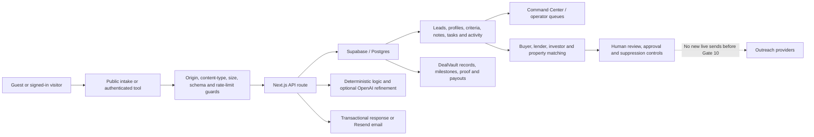

# VestBlock Gate 4B.1 — Current-State Audit and Experience Contract

Audit date: August 12, 2026

Active gate: **4B.1 — Current-State Audit and Experience Contract**

Status: **PASS — audit complete; release readiness remains blocked by the findings below**

Approved baseline: `b1f2428c7ab04f10480119f9241b257a910f05bb` on `codex/operation-rebrand-final`

Production: <https://vestblock.io>

This gate was read-only except for this audit artifact. It did not change application code, database data, production configuration, scheduled jobs, outreach state, or the deployed website. It did not begin Gate 4B.2.

## Scope and verification contract

Gate 4B.1 inspected the current public and authenticated route inventory, homepage, hero, navigation, typography, buyer/seller/lender journeys, authentication, database declarations, APIs, scheduled jobs, CRM and outreach code, integrations, Command Center, privacy/security controls, and responsive behavior.

Expected file change: this document only. Expected runtime changes: none. Production deployment and live outreach remain explicitly prohibited until their later approved gates.

Verification used the Mac Pro as the execution host. The approved b1 commit was transferred into an isolated Mac Pro worktree at `/tmp/vestblock-gate4b1.kSJGOr`, installed with its locked dependencies, built with the Mac Pro's existing local environment, and served only on the local network for visual inspection. No production write endpoint was invoked.

## 1. Release-state truth

There is no single synchronized code state today. The three relevant states must remain distinct in every later gate.

| State | Branch / artifact | Revision | Truth |
| --- | --- | --- | --- |
| Owner-approved Gate 4A baseline | `codex/operation-rebrand-final` | `b1f2428` | Clean before this audit; nine commits ahead of its remote; builds and renders on the Mac Pro; **not deployed** |
| Live Vercel production | deployment `dpl_F9ga1JMyQs9yunvm5VZ4Eo4U78XN` | runtime reports `2fcc5b6` | Ready and healthy, but older than b1; aliases include `vestblock.io` and `www.vestblock.io` |
| Mac Pro primary checkout | `codex/vestblock-unified-release-candidate` | `9b8b66e` | Clean, later and divergent design work; **not the approved b1 baseline** |

The approved baseline and the Mac Pro primary checkout share earlier history but have diverged. Gate 4B.2 must prototype from b1 unless the owner explicitly resolves the branch conflict. Nothing from `9b8b66e` may be silently adopted merely because it is newer.

Production `/api/health` returned HTTP 200 with `status: healthy`, Node runtime, Supabase configured, analytics false, and commit `2fcc5b6`. Health does not mean production contains Gate 4A.

## 2. Current-state route map

The executable closure matrix reports **104 pages and 202 API handlers (306 total), with zero unassigned items**. The route groups below account for the page surface at b1. Existence means implemented in source, not end-to-end production proof.

| Group | Current b1 routes | Current truth |
| --- | --- | --- |
| Master discovery | `/`, `/get-started`, `/services`, `/services/[slug]`, `/pricing`, `/resources`, `/resources/[slug]`, `/learn`, `/learn/[slug]`, `/es/vestblock`, `/proof` | Partial. Large directory surface; `/get-started` and `/next-move` overlap as entry decisions. |
| Capital and preparation | `/funding`, `/funding/business-funding-strategy`, `/business-setup`, `/real-estate-funding`, `/real-estate-funding/thanks`, `/calculators`, `/property-analyzer` | Implemented; individual paths have different proof levels. No `/capital` hub. |
| Real-estate and network intake | `/sell`, `/sell/[market]`, `/buyers`, `/lenders`, `/deal-hunter`, `/dealflow-growth-system`, `/partners/buyers/[token]`, `/partners/lenders/[token]` | Implemented, fragmented. No `/real-estate` hub. Current navigation sends “Deals” directly to `/sell`. |
| Opportunity and growth | `/next-move`, `/next-move/manage`, `/ai-assistant`, `/visibility-expansion`, `/visibility-expansion/case-study`, `/visibility-expansion/proof-hub`, `/smart-contracts` | Partial. b1's Next-Move flow is tested; no `/opportunity` hub. |
| DealVault public | `/dealvault`, `/dealvault/demo`, `/dealvault/demo-record` | Implemented. Canonical required `/deal-vault` is absent. |
| Authentication and identity | `/login`, `/register`, `/forgot-password`, `/reset-password`, `/profile`, `/affiliates/register`, `/affiliates/application-pending` | Partial. Core email/password and recovery exist; no `/join`, universal role selection, or multi-role persistence. |
| Customer workspace | `/dashboard`, `/dashboard/funding`, `/dashboard/services`, `/user-hub`, `/roadmap`, `/chat`, `/analysis/results/[jobId]`, `/credit-dashboard/[reportId]`, `/credit-upload`, `/credit-report-diagnostic`, `/super-dispute`, `/tools/*` | Implemented but split across several dashboard concepts; needs unified ownership and journey proof in later gates. |
| Authenticated DealVault | `/dashboard/dealvault`, `/dashboard/dealvault/[dealId]`, `/dashboard/dealvault/new`, `/dashboard/dealvault/milestone-vault`, `/dashboard/dealvault/partner-pay`, `/dashboard/dealvault/proof-vault` | Implemented but not re-verified in this read-only gate. |
| Operations | `/admin`, `/admin-panel`, `/admin-panel/reports/[reportId]`, `/admin-panel/users/[userId]`, 31 `/admin/*` pages including `/admin/command-center` | Extensive implemented surface; authorization redirect verified anonymously. Later Gate 4H must prove the authenticated workflows. |
| Diagnostics | `/auth-debug`, `/database-diagnostic`, `/setup-database`, `/admin/test`, `/dev/command-center-preview` | Must remain protected or development-only; not public product routes. |

Production reachability differs materially from b1:

| Production route | Result | Interpretation |
| --- | ---: | --- |
| `/`, `/funding`, `/sell`, `/buyers`, `/lenders`, `/dealvault`, `/get-started`, `/login` | 200 | Existing live paths |
| `/dashboard` | 307 to `/login?redirect=%2Fdashboard` | Protected correctly at the anonymous boundary |
| `/admin/command-center` | 307 to `/login?redirect=%2Fadmin%2Fcommand-center` | Protected correctly at the anonymous boundary |
| `/capital`, `/real-estate`, `/opportunity`, `/deal-vault`, `/join` | 404 | Required target architecture is not live or present at b1 |
| `/next-move` | 404 | Gate 4A's tested free questionnaire is not deployed |
| `/privacy`, `/privacy-policy`, `/terms`, `/security` | 404 | Public legal/security destinations are missing |

## 3. Locked target route contract

The following public route language and purpose are locked for later implementation:

| Route | Navigation label | Purpose | Guest behavior |
| --- | --- | --- | --- |
| `/` | Home / brand | Explain VestBlock as one connected financial-opportunity platform, then help a visitor choose a scenario | Full exploration |
| `/capital` | Capital | Hub for business funding, real-estate funding, acquisition capital, business-credit readiness, verified programs, and capital-provider participation | Explore before account |
| `/real-estate` | Real Estate | Balanced hub for sellers, buyers, investors/wholesalers, agents, lenders, builders/developers, property analysis, and deal funding | Explore before account; never jump directly to seller intake |
| `/opportunity` | Opportunity | Hub for free roadmap, credit/readiness, income paths, business creation/growth, verified programs, and support services | Explore before account |
| `/deal-vault` | DealVault | Public DealVault product explanation and entry to authenticated records | Explore; account at save/create boundary |
| `/join` | Join | Universal registration that preserves originating intent and allows more than one role | Public |
| `/login` | Sign in | Login and recovery entry that preserves safe return intent | Public |

Specialized routes remain valid beneath this architecture. A hub must not erase a purpose-built intake merely to reduce route count.

## 4. Redirect and canonicalization plan

Redirects are **planned only** here; none were implemented.

| Current route | Target behavior | Rule |
| --- | --- | --- |
| `/dealvault` and `/dealvault/*` | Canonicalize public pages to `/deal-vault` and equivalent descendants | Permanent after parity; preserve query and fragments |
| `/register` | `/join` | Temporary while rollout is measured, then permanent after auth parity; preserve `redirect` and `email` |
| `/funding` | Remain a specialized business-funding page linked from `/capital` | Do not collapse into the hub until every intent and anchor has a mapped destination |
| `/real-estate-funding` | Remain specialized, linked from Capital and Real Estate | Preserve submitted context and thanks flow |
| `/sell`, `/buyers`, `/lenders` | Remain specialized flows linked from `/real-estate` | Do not redirect these high-intent paths back to a generic hub |
| `/next-move` | Remain the free questionnaire linked from `/opportunity` and the homepage | Do not make `/opportunity` a substitute for an in-progress questionnaire |
| `/get-started` | Keep until its role is reconciled with the homepage selector and `/next-move` | Later decide between a compatibility route and intent-preserving redirect |
| `/admin-panel` | Consolidate on `/admin/command-center` only after every report/user deep link is mapped | Preserve operator bookmarks and authorization |

All redirect handlers must use a same-origin allowlist and retain safe return-to-intent data. No open redirect or silent loss of an in-progress form is acceptable.

## 5. Role and journey matrix

The target account model is multi-role. Current b1 stores a single `user_profiles.role` string and registration asks only for name, email, and password; therefore every role beyond the single stored value is currently incomplete at the identity layer.

| Role | Current entry / destination | Current status | Contract for later gates |
| --- | --- | --- | --- |
| Individual | `/next-move`, credit and roadmap tools | Partial | May choose several goals; save questionnaire/roadmap after clear account boundary |
| Entrepreneur | `/next-move`, `/funding`, `/business-setup` | Partial | Capital and Opportunity role; retain business stage, funding/readiness intent, and roadmap |
| Investor | `/buyers`, property analyzer, admin-only investor engine | Partial | First-class investor profile, criteria, capital need, and opportunity visibility |
| Buyer | `/buyers` -> `buyers`, buy-box, market, contact, task/match records | Implemented, later proof required | Free signup, reusable buy box, consented contact, editable criteria, matching status |
| Seller | `/sell` -> `real_estate_leads` plus CRM lead | Implemented, later proof required | Property-specific intake, status, requested follow-up, privacy and consent controls |
| Wholesaler | Buyer flow or generic Next-Move | Missing as first-class role | Store acquisition/disposition markets and lawful relationship preferences without redefining all Real Estate |
| Real-estate agent | No clear public role path | Missing | Role-specific market, license/relationship context, service boundary, and referral/compliance routing |
| Lender | `/lenders` -> lender/products/programs/contact/match records | Implemented, later proof required | Criteria-first free participation, editable lending box, review and match status |
| Capital provider | Currently blended into lender flow | Partial | Distinguish debt, equity, grant/program, and other capital criteria; do not imply lender status |
| Builder | `/next-move?focus=builder-developer` only | Partial | Multi-role project profile, geography, capabilities, capital/inventory need, and review state |
| Developer | Same generic builder/developer focus | Partial | Separate development criteria, project stage, capital need, and partner needs |
| Business buyer | `/next-move?focus=business-acquisition` | Partial | Acquisition criteria, diligence/readiness, capital need, and save/resume |
| Business seller | No first-class entry | Missing | Confidential business-sale intent, industry/size/timeline, consent and operator review boundary |
| Service provider | Affiliate/partner and generic service forms | Partial | Offer, coverage, credentials/claims, capacity, and explicit visibility/consent settings |
| Partner | `/affiliates/register`, tokenized buyer/lender portals | Partial | Universal account plus partner-specific permissions; token links cannot become a second identity system |
| Operator/admin | `/admin/command-center` and admin route family | Implemented, later proof required | RBAC, auditable decisions, queue ownership, approvals, suppressions, data visibility and safe overrides |

One person may hold multiple roles. Role selection must be additive, editable, and separate from administrator privilege. `admin` is an authorization capability, not a marketing persona the user can self-select.

## 6. Current data-flow map

### Concrete current destinations

| Journey | Durable destination | Additional behavior | Current truth |
| --- | --- | --- | --- |
| Free Next-Move | `leads`, `next_move_questionnaires`, optional `admin_tasks`; lifecycle events in `admin_activity`/`email_events` | Deterministic roadmap, optional OpenAI refinement, Resend transactional roadmap, export/delete lifecycle | Complete in b1 and controlled-test verified; missing in production |
| Seller | `real_estate_leads` and `leads` | Attribution and operator review context | Implemented; live downstream review not re-exercised |
| Buyer | `buyers`, `buyer_buy_boxes`, `buyer_markets`, `buyer_contacts`, tasks/matches and relationship tables | Criteria matching, packets, portal and admin records | Implemented; full buyer lifecycle remains a later gate |
| Lender | `lenders`, `lender_products`, `lender_programs`, `lender_contacts`, tasks/matches and relationship tables | Borrower/deal matching, portal and admin records | Implemented; full lender lifecycle remains a later gate |
| Real-estate funding | `leads` plus funding/review metadata | Partner/lender review handoff | Implemented; provider outcome not guaranteed or re-tested |
| Authenticated funding assistant | `funding_profiles`, `funding_recommendations`, `funding_sequence_items`, `funding_products`, `funding_payments`, `funding_events` | Deterministic sequencing, application tracking and approvals | Implemented; contains mock-data import for initial/default product behavior and needs later truth audit |
| CRM / operations | `leads`, notes/scores/suppressions, `admin_tasks`, `admin_activity`, Command Center memory/jobs/strategy tables | Queueing, summaries, approval and operator actions | Broadly implemented; later Gate 4H owns operational proof |
| Outreach | buyer/lender/investor/outreach message, run, event, suppression, provider-delivery and reply-memory tables | Drafting, caps, approvals, suppression, delivery reconciliation, mailbox sync | Operational evidence exists; governance conflict described below |
| DealVault | public and authenticated DealVault tables for deals, proofs, milestones, payouts, usage and blockchain transaction records | Private record layer plus optional chain evidence | Implemented; full access and chain proof not run in this gate |

Source migrations declare **132 tables**, explicit RLS enablement for every declared table, and **248 policy statements**. A service-role RPC reported **161 live public tables**, including all major current destinations above. This proves live table presence, not the complete live policy state. The Mac Pro has neither `psql` nor Supabase CLI, so the repository's direct SQL security audit could not inspect live policy grants, security-definer functions, trigger ownership, migration history, or all row-level rules. That audit dependency must be restored before Gate 4B.3 security sign-off.

## 7. Current automation and integration map

`vercel.json` schedules 14 workflows: boss loop, operator report, strategy engine, source orchestration, seller follow-up, partner pipeline, LinkedIn task queue, mailbox sync, ATTOM enrichment, improvement review, AEO audit, entity SEO, content publishing, and indexing push.

A read-only Mac Pro capability audit queried production evidence without triggering any workflow:

| Capability | Evidence | Status |
| --- | --- | --- |
| Supabase | Service-role connection works; 161 live public tables discovered | Complete for connectivity; live security audit still blocked |
| Outlook / Microsoft Graph | Credentials present; 1,034 reply-memory records; latest evidence about 2 hours old | Complete at connectivity/evidence level |
| Strategy source and execution | 1,099 source rows and 424 ingested in 48 hours; latest report status `partial` | Partial despite audit's “healthy” label |
| Provider delivery | 25 memberships in accepted/sent/delivered/opened/clicked/replied states in 48 hours | **Unsafe governance conflict:** production activity exists although this new gate controller prohibits live outreach before Gate 10 |
| DealMachine contact export | Code and Mac Pro watcher exist; zero recent sync/export/ingest evidence | Disconnected/unproven |
| ATTOM | Production Vercel has ATTOM variables and 7,496 records; Mac Pro local env lacks the key expected by the audit while the schedule exists | Partial / primary-host config drift |
| Daily operator report | 60 reports, current-day evidence | Complete at evidence level |
| AEO, entity SEO, publishing, indexing | Recent production records for each | Complete at evidence level, not content-quality approval |
| Continuous improvement | 253 runs, recent evidence | Complete at execution level; automated recommendations remain reviewable data, not permission to self-deploy |
| LinkedIn | 26 recent task-batch records | Manual queue only; no automatic LinkedIn sender claimed |
| n8n | Production/local webhook names exist, but URL was previously invalid, API key is absent, and runtime source contains zero n8n references | Disconnected; not part of the operating app |
| Buffer | Credentials and a VestBlock Facebook channel exist; only standalone scripts reference it | Configured but disconnected from product workflows |
| Resend | Configured and controlled Next-Move transactional delivery was previously accepted | Partial; no campaign send authorized here |
| OpenAI | Configured and used by multiple analysis/drafting paths with fallbacks | Implemented; individual claims and traceability require later-gate proof |
| PayPal | Configured with order and webhook routes | Implemented but unverified in this gate |
| PostHog | No application/package references; stale local environment names exist | Obsolete credential residue; no product dependency |
| Twilio / Postiz | No application/package references | Not used; keep absent |
| OpenAI Ads | Credential name exists; no direct code use | Configured but disconnected; not an ad platform approval or active campaign |

No job was triggered and no message was sent. Because recent provider-accepted evidence conflicts with the present gate boundary, Gate 5/6/10 planning must reconcile existing schedules, historical authorizations, auto-send flags, and approval logs before any outreach work. Do not infer permission from an already-running cron.

## 8. Functional inventory

| System | Classification | Evidence / gap |
| --- | --- | --- |
| Production domain and health | Complete | HTTP 200, Vercel Ready, Supabase configured |
| Owner-approved b1 build | Complete | `pnpm typecheck` and `pnpm build` pass on Mac Pro; 247 static pages generated |
| Source-to-production alignment | Unsafe for production | Production is `2fcc5b6`, b1 is not deployed, and Mac Pro main checkout is a third revision |
| Required public navigation contract | Missing | Current `Capital / Deals / Opportunity / DealVault` routes to `/funding`, `/sell`, `/next-move`, `/dealvault` |
| Capital hub | Missing | Specialized Capital paths exist; `/capital` does not |
| Real Estate hub | Missing | Multiple strong workflows exist; `/real-estate` does not and “Deals” sends visitors to sellers |
| Opportunity hub | Missing | Next-Move and support paths exist; `/opportunity` does not |
| Canonical DealVault route | Missing | `/dealvault` exists; `/deal-vault` does not |
| Universal Join | Missing | `/register` exists without role capture; `/join` does not |
| Next-Move questionnaire | Complete in b1 / disconnected from production | Gate 4A controlled journey verified storage, consent, task, transactional email, export and deletion; production 404 |
| Hero media and motion | Complete in b1 / missing in production | b1 plays a real local video with assistant overlay, chapter changes, pause control and reduced-motion asset; production has no video element |
| Homepage explanation | Partial | Professional top-line story exists, but directory plus three repeated six-offer sections makes b1 9,460 px desktop / 12,494 px mobile and weakens decision flow |
| Buyer intake and matching | Partial | Durable criteria and matching code exist; no unified account/role journey or current complete E2E proof |
| Lender intake and matching | Partial | Durable criteria and matching code exist; capital-provider distinction and complete E2E proof are missing |
| Seller intake | Partial | Durable CRM destinations exist; status and account continuity are not unified |
| Authentication and recovery | Partial | Signup/login/forgot/reset, safe redirects and protected routes exist; universal multi-role and guest conversion do not |
| Customer workspace | Partial | Multiple dashboards and tools exist; information architecture is fragmented |
| CRM / Command Center | Partial | Extensive real tables, APIs and UI; authenticated operations not run in this gate |
| Outreach drafting/queues | Partial | Real message/run/suppression/evidence systems exist; live-governance state is unresolved |
| n8n | Disconnected | No runtime integration |
| Buffer | Disconnected | Standalone script only |
| Legal pages | Missing / unsafe for release | Production and b1 lack public Privacy, Terms and Security routes |
| PDF/OCR extraction | Placeholder | Source explicitly returns placeholder extraction for some PDF/image paths |
| Funding assistant defaults | Partial / placeholder risk | Imports `lib/funding/mock-data`; must separate UI defaults from customer-facing recommendations |
| Public request guards | Complete for Gate 4A scope | Same-origin, JSON, size, validation, rate limiting and response minimization were verified on 13 public mutations |
| Live database security attestation | Disconnected | Audit script exists but cannot run on Mac Pro without a PostgreSQL client |

### Dead ends, duplicates and obsolete surfaces

- Required canonical hubs and `/join` are 404.
- Production homepage points to `/get-started`; b1 navigation points to `/next-move`; the two starting concepts are not reconciled.
- “Deals” obscures Real Estate and routes directly to seller intake, excluding buyers and other roles.
- `/dashboard`, `/dashboard/services`, `/user-hub`, `/get-started`, and `/roadmap` expose overlapping workspace/starting concepts.
- `/admin`, `/admin-panel`, and `/admin/command-center` expose overlapping operator entry concepts.
- Legacy cyan/purple gradients, glass surfaces and generic card patterns remain in older tools while the homepage/Command Center use a dark lime editorial system.
- PostHog environment residue, n8n names, Buffer scripts and OpenAI Ads configuration have no active product destination.
- `robots.txt` allows `/ai-assistant` in one rule and disallows it later, creating contradictory crawler intent.
- Public legal destinations are absent even though forms collect personal and financial-context information.

## 9. Homepage narrative contract

Gate 4B.2 must prototype this sequence without replacing production:

1. **Immediate definition:** VestBlock helps people and businesses find and carry out a practical next move across Capital, Real Estate, Opportunity and DealVault.
2. **Human scenario:** Ask “What are you trying to do next?” with a small set of outcome choices, not a product catalog.
3. **Short route preview:** Explain the recommended lane, what VestBlock does, what a partner decides, and whether the next step is free, account-based, paid or review-dependent.
4. **How the system helps:** Capture context, organize readiness, route to the right workflow, then retain active proof/status.
5. **Role-aware proof:** Show credible examples for both consumers and network participants without implying guarantees.
6. **DealVault continuity:** Explain when an opportunity becomes active work and why records, milestones, agreements or payout references matter.
7. **One resolved action:** Continue the chosen path or build the free roadmap; request registration only at save, submit, match or personalized-continuation boundaries.

Do not render the current directory and then repeat every item in three full catalogs. Detailed inventories belong on hubs and progressive-disclosure surfaces.

## 10. Design, typography and responsive findings

### Production baseline

- At 1440 × 1100 and 390 × 844, the homepage had zero horizontal overflow and loaded its fonts.
- The live hero is a premium static photograph, not an animated scene; the DOM contains no `<video>`.
- The subject and AI interaction are not clearly legible in the live crop.
- Mobile page height is about 7,448 px and the progression becomes a long run-on service page.
- Production navigation uses the obsolete “Deals” label and wrong destinations.

### Approved b1 baseline

- The local Mac Pro render contains one playing hero video (`desktop.webm` at desktop; responsive source available for mobile), ready state 4, a visible Black business owner, a purposeful assistant overlay, chapter evidence, pause control, and reduced-motion fallback.
- The hero is materially closer to the approved direction than production, but the assistant remains visually detached/translucent and the overlay does not yet communicate a believable conversation as strongly as the brief requires.
- The first viewport is composed and contained; the content below it is not. Page height is about 9,460 px desktop and 12,494 px mobile.
- Mobile has no horizontal overflow, but the opening stacks copy, actions and media into a dense 844 px viewport before the user reaches the decision section.
- The three doorways are useful, but still say “Deals” and are followed by both a summary directory and three complete offer catalogs.

### Typography and visual system

- Global Inter is technically sound, readable and reliable, so a font replacement is not automatically justified.
- The large display treatment is strong, but heavy negative tracking, small uppercase kickers and repeated 0.55–0.67rem metadata reduce comfortable reading, especially on mobile.
- Gate 4B.2 must compare Inter against no more than two credible alternatives at real navigation, hero, body, form and Command Center sizes before choosing.
- The current codebase mixes the approved black/lime editorial system with legacy cyan, purple, glowing, glass and rounded-card interfaces. The inconsistency is more damaging than the specific font.
- Motion in b1 has states and scroll response; motion in older interfaces often reads as decoration. Later work must use motion to show choice, routing, evidence and resolution.

## 11. Credential and external-service dependency list

No secret values are recorded in this audit.

### Present and evidenced

- Vercel authentication and linked project access.
- Supabase public/service-role configuration and production connectivity.
- OpenAI, Resend, Microsoft Graph/Outlook, PayPal, DealVault, Google/Search Console/Places, SAM.gov, IndexNow, DealMachine, Buffer and other production variable names described in the prior Gate 0 inventory.
- VestBlock Outlook mailbox connectivity and recent evidence.

### Required before the owning later gate can pass

| Dependency | Need | Owner action now? |
| --- | --- | --- |
| Source-of-truth branch decision | Keep b1 as the prototype base or explicitly reconcile `9b8b66e`; never merge by accident | **Yes, only if Gate 4B.2 should use anything from the newer Mac Pro branch** |
| PostgreSQL client (`psql`) or Supabase CLI on Mac Pro | Run `scripts/supabase-live-audit.mjs` and attest live RLS/functions/triggers/migrations | Not for visual prototype; required before Gate 4B.3 passes |
| Auth QA accounts | Standard, multi-role, admin and recovery mailbox credentials | Required in Gate 4B.3; can be dedicated test accounts |
| n8n | Valid HTTPS webhook endpoint and `N8N_API_KEY` only if n8n is retained and app-managed | No purchase/sign-up now; decide retain vs remove in Gate 5 |
| ATTOM primary-host config | Align Mac Pro local audit config with Vercel production or document intentional server-only use | Required before property automation sign-off |
| DealMachine export path | Prove watcher, authenticated export ingest and recent evidence, or remove the claim | Required in the owning automation gate |
| Resend / Graph test policy | Dedicated internal recipients and evidence-retention rules | Required before controlled messaging tests; no external sends now |
| Privacy/Terms/Security content | Owner/legal review of actual business practices and contact information | Required before release gate; generated boilerplate is insufficient |
| Paid media / external assets | Separate owner approval before purchase or campaign activation | Not authorized |

Stale PostHog variables should be removed from local environments during an authorized integration-cleanup gate after confirming no hidden external dependency. Twilio and Postiz should remain absent.

## 12. Exact Gate 4B.2 implementation plan

Gate 4B.2 is prototype-only and begins only after the exact command `APPROVE GATE 4B.2`.

1. **Freeze the comparison baseline.** Use b1 and the four Gate 4B.1 screenshots; do not edit production routes or deploy. Record any owner-approved asset borrowed from the divergent branch before use.
2. **Create an isolated prototype surface.** Use a development-only route or static story surface excluded from sitemap and production navigation. It may use representative data only; it must not write to Supabase or call outreach APIs.
3. **Prototype the target navigation.** Desktop and mobile states must show Capital, Real Estate, Opportunity and DealVault plus Join/Login; verify focus order, menu dismissal, active state and 320/390/768/1440 widths.
4. **Prototype the seven-part homepage narrative.** Replace repeated catalogs in the prototype with the scenario selector, concise route preview, system explanation, proof, DealVault continuity and one resolved CTA.
5. **Prototype scenario routing.** Include fund/grow a business, find/finance property, sell property, income/credit readiness, and offer capital/inventory/services. Each result must name the target lane, access requirement, next step and qualification boundary.
6. **Create three hero storyboards using existing owned assets.** A contained opening, human/assistant interaction state and resolved routing/evidence state. Specify video/GSAP timings, load poster, mobile crop, pause control and reduced-motion frame. Do not buy or generate paid media.
7. **Run the typography comparison.** Current Inter plus at most two alternatives, shown in navigation, 64–96 px display, 18–20 px body, 14–16 px controls, 12–14 px metadata and Command Center dense data. Document rendering/performance and keep Inter if no alternative is clearly better.
8. **Unify prototype tokens.** Demonstrate one restrained black/lime/neutral editorial system across marketing, a workspace specimen and a Command Center specimen; remove generic glow/glass/card effects from the prototype only.
9. **Motion and accessibility verification.** Check opening/transition/resolution states, keyboard operation, contrast, meaningful alt text, media failure, `prefers-reduced-motion`, no layout shift, no blank state and zero horizontal overflow.
10. **Separate reviews.** First a design/art-direction review, then a fresh-eyes comprehension review using no implementation context. Resolve all major findings before requesting approval.
11. **Deliver comparison evidence.** Current production vs b1 vs prototype desktop/mobile screenshots, short interaction capture, typography board, route outcomes, reviewer findings and implementation estimate for Gate 4B.3/4C.
12. **Stop.** Commit only prototype artifacts and gate documentation, confirm a clean worktree, report PASS/BLOCKED, and wait for `APPROVE GATE 4B.3`.

## 13. Screenshots

Ignored local QA evidence:

- `output/playwright/gated-completion/gate-4b1/production-home-desktop.png` — 1440 × 1100
- `output/playwright/gated-completion/gate-4b1/production-home-mobile.png` — 390 × 844
- `output/playwright/gated-completion/gate-4b1/approved-b1-home-desktop.png` — 1440 × 1100
- `output/playwright/gated-completion/gate-4b1/approved-b1-home-mobile.png` — 390 × 844

The approved-baseline screenshots were captured only after rebuilding on the Mac Pro with its existing public runtime configuration. An earlier env-free render correctly failed with missing public Supabase variables and was overwritten; the failure is retained here as a dependency finding.

## 14. Diagnostics and inspected files

Diagnostics run:

- `pnpm audit:gate4-matrix` — PASS, 104 pages, 202 handlers, 306 items, zero unassigned.
- `pnpm typecheck` in isolated Mac Pro b1 worktree — PASS.
- `pnpm build` in isolated Mac Pro b1 worktree with locked dependencies and Mac Pro env — PASS; 247 static pages generated; pre-existing non-blocking lint warnings remain.
- Production health, Vercel deployment inspection and HTTP route sweep.
- Production capability audit through read-only Supabase queries — nine healthy, one manual-queue-only, one blocked, one unproven; interpretation corrected in this document where the script's label overstates truth.
- Source migration inventory — 132 declared tables, explicit RLS on all declared tables, 248 policies.
- Live service-role table inventory — 161 public tables.
- Playwright desktop/mobile checks on production and b1 — screenshots, navigation, video state, page height and horizontal overflow.
- Runtime searches for n8n, PostHog, Twilio and Postiz — zero active app/package references.
- `git diff --check` and focused documentation review before commit.

Primary files and areas inspected:

- `app/page.tsx`, `components/cinematic/cinematic-hero.tsx`, `components/home/homepage-directory.tsx`, `components/navigation.tsx`, `app/layout.tsx`, `app/globals.css`
- authentication pages, `contexts/auth-context.tsx`, `middleware.ts`, `lib/auth/*`
- Next-Move, seller, buyer, lender, funding, DealVault, CRM, outreach and Command Center pages/APIs/libraries
- `db/migrations/*`, `supabase/migrations/*`, `scripts/supabase-live-audit.mjs`
- `vercel.json`, `package.json`, `scripts/platform-capability-audit.mjs`, `scripts/gate4-closure-matrix.mjs`
- `.vercel/project.json` and production environment **names only**
- `docs/VESTBLOCK_GATE_0_PRODUCTION_BASELINE.md`, `docs/VESTBLOCK_GATE_4A_PUBLIC_ROUTES.md`, `docs/VESTBLOCK_GATE_4_CLOSURE_MATRIX.md`

## Gate 4B.1 verdict

**PASS.** The audit reflects the approved repository, Mac Pro runtime, deployed Vercel artifact and observable production data; distinguishes complete, partial, placeholder, disconnected, missing and unsafe systems; defines the target routes and multi-role contract; records data and automation destinations; identifies dead ends and obsolete tools; and contains no later-gate implementation.

This PASS does **not** mean VestBlock is ready to deploy or start outreach. Branch/deployment divergence, missing canonical hubs and legal pages, incomplete universal identity, live database security attestation, disconnected n8n/Buffer, ATTOM host drift, DealMachine evidence, and the existing provider-activity governance conflict remain later-gate blockers.

Required next command: `APPROVE GATE 4B.2`
